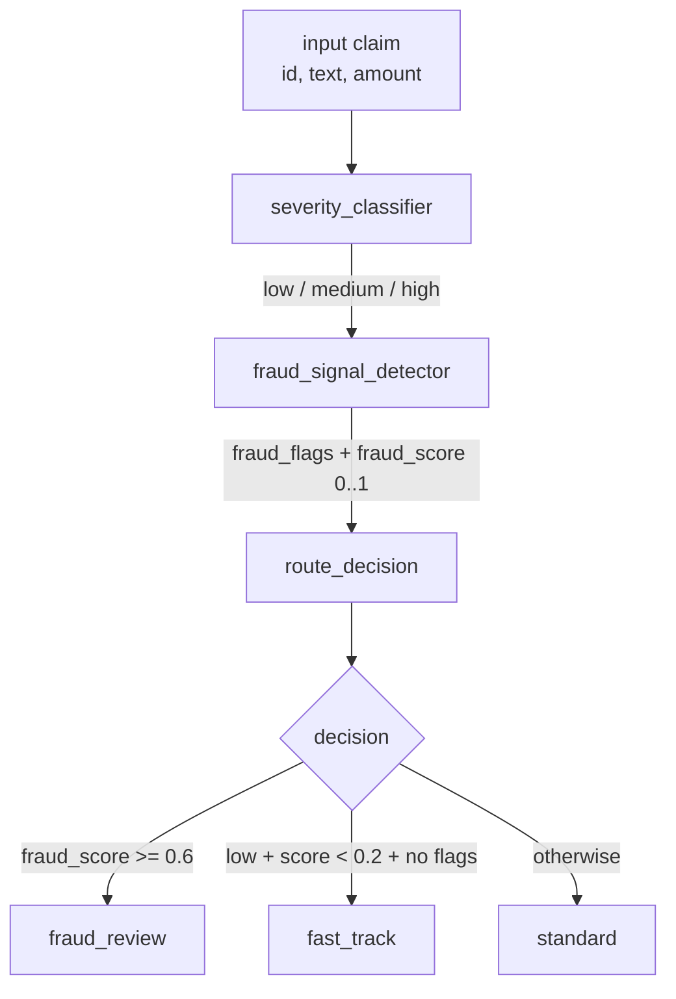

# Claim Triage Agent

A small LangGraph agent that triages Indian health-insurance claims into one of three queues: **fast-track**, **standard**, or **fraud-review**.

Runs on **any open-source LLM you can serve locally** — Gemma 2, Llama 3, Mistral, Phi, etc. — through the OpenAI-compatible API exposed by **LM Studio** or **Ollama**. No paid API keys required. Anyone with a laptop can clone, run, and modify it.

## Why

Most insurance claim systems route on rigid rules. This agent uses an LLM at each decision point — severity assessment, fraud signal detection, final routing — and produces a transparent reasoning trace alongside every decision. Built as a focused demo of multi-node agent orchestration with LangGraph: single LLM call per node, no web UI, no database, no auth.

## Architecture



3 nodes. 1 LLM call per node. State carried as a `TypedDict`. Every node appends a one-line entry to `reasoning_trace` so every routing decision is auditable end-to-end.

## State Schema

```python
class TriageState(TypedDict):
    claim_id: str
    claim_text: str
    claim_amount: float
    severity: Literal["low", "medium", "high"] | None
    fraud_flags: list[str]
    fraud_score: float | None
    decision: Literal["fast_track", "standard", "fraud_review"] | None
    reasoning_trace: list[str]
```

## Quick Start

```bash
git clone git@github.com:thakkarsagar12/claim-triage-langgraph.git
cd claim-triage-langgraph
python3 -m venv .venv && source .venv/bin/activate
pip install -r requirements.txt
cp .env.example .env
```

Then start a local LLM server using **either** of the options below, edit `.env` to match, and run:

```bash
python triage.py
```

### Option A: LM Studio (GUI)

1. Install [LM Studio](https://lmstudio.ai/).
2. Search for and download `google/gemma-2-9b-it` (or any chat-tuned GGUF you prefer).
3. Open the *Local Server* tab and click **Start Server** (default port `1234`).
4. In `.env`:
   ```
   LLM_BASE_URL=http://localhost:1234/v1
   LLM_MODEL=google/gemma-2-9b-it
   LLM_API_KEY=local-no-key-needed
   ```

### Option B: Ollama (CLI)

```bash
brew install ollama          # macOS
ollama serve &               # default port 11434
ollama pull gemma2:9b        # or gemma2:2b for a lighter laptop
```

In `.env`:

```
LLM_BASE_URL=http://localhost:11434/v1
LLM_MODEL=gemma2:9b
LLM_API_KEY=ollama
```

### Option C: Anything OpenAI-compatible

vLLM, TGI, llama.cpp's server, or even OpenAI itself — point `LLM_BASE_URL` and `LLM_MODEL` at it. The code only assumes the OpenAI chat-completions wire format.

## What's In The Box

| File | Purpose |
|---|---|
| `triage.py` | Graph definition, three nodes, runner |
| `claims.py` | 5 synthetic Indian-context claims for smoke testing |
| `.env.example` | Minimal config for LM Studio / Ollama / OpenAI |
| `requirements.txt` | Python dependencies |
| `BACKLOG.md` | Anti-scope list — features intentionally not in v1 |

## Sample Run (Gemma 2 9B, LM Studio, M1 Max)

End-to-end run on the 5 seeded claims, ~30 seconds total:

```
LLM base URL : http://localhost:1234/v1
LLM model    : gemma-2-9b-it
Claims to run: 5

=== CLM-2026-0001 ===  (small honest OPD,  INR 4,500)
  severity   : low
  fraud_score: 0.0
  fraud_flags: []
  DECISION   : FAST_TRACK
  trace:
    - [severity] low - Routine outpatient consultation and blood work with a low claim amount.
    - [fraud] score=0.0 flags=[] - Claim appears legitimate with provided documentation.
    - [decision] fast_track - Rule 2 matched

=== CLM-2026-0002 ===  (CABG, urgent surgery, INR 8,50,000)
  severity   : medium
  fraud_score: 0.0
  fraud_flags: []
  DECISION   : STANDARD
  trace:
    - [severity] medium - CABG surgery is complex and requires multi-step processing.
    - [fraud] score=0.0 flags=[] - Claim appears legitimate with provided documentation.
    - [decision] standard - otherwise

=== CLM-2026-0003 ===  (repeat OPD pattern, INR 12,500)
  severity   : medium
  fraud_score: 0.7
  fraud_flags: ['repeated_claim_pattern', 'inconsistent_records', 'documentation_gaps']
  DECISION   : FRAUD_REVIEW
  trace:
    - [severity] medium - Multiple claims from the same clinic with inconsistencies raise suspicion.
    - [fraud] score=0.7 flags=['repeated_claim_pattern', 'inconsistent_records', 'documentation_gaps'] - Multiple claims from the same clinic with questionable documentation raise suspicion.
    - [decision] fraud_review - Rule 1: fraud_score >= 0.6

=== CLM-2026-0004 ===  (lump-sum 'chest pain' claim, INR 1,25,000)
  severity   : medium
  fraud_score: 0.6
  fraud_flags: ['documentation gaps', 'vague descriptions', 'inconsistent records']
  DECISION   : FRAUD_REVIEW
  trace:
    - [severity] medium - Lack of itemization and unclear dates raise concerns about potential discrepancies.
    - [fraud] score=0.6 flags=['documentation gaps', 'vague descriptions', 'inconsistent records'] - Missing details and conflicting information raise suspicion.
    - [decision] fraud_review - Rule 1: fraud_score >= 0.6

=== CLM-2026-0005 ===  (stroke emergency, INR 4,50,000)
  severity   : high
  fraud_score: 0.0
  fraud_flags: []
  DECISION   : STANDARD
  trace:
    - [severity] high - Stroke is a life-threatening condition requiring urgent medical attention and ongoing care.
    - [fraud] score=0.0 flags=[] - Claim appears legitimate with detailed documentation.
    - [decision] standard - otherwise
```

Routing summary:

| Claim | Severity | Fraud score | Decision |
|---|---|---|---|
| CLM-2026-0001 small OPD | low | 0.0 | fast_track |
| CLM-2026-0002 CABG urgent | medium | 0.0 | standard |
| CLM-2026-0003 repeat OPD | medium | 0.7 | fraud_review |
| CLM-2026-0004 lump-sum admit | medium | 0.6 | fraud_review |
| CLM-2026-0005 stroke emergency | high | 0.0 | standard |

The same code also runs against Qwen 3.5 35B-A3B (uncensored), Mistral Small 24B, GLM 4.7 Flash, and any other OpenAI-compatible local model — performance and routing fidelity vary by model size.

## Design Choices Worth Calling Out

- **One LLM call per node.** No tool calling, no chains. Each node has a single, narrow job and returns a JSON object that mutates the state.
- **Reasoning trace as state.** Every node appends its decision + one-sentence reason to `reasoning_trace`. Auditable end-to-end without any logging framework.
- **Local-first.** The default config targets LM Studio because no one wants to spin up a paid API key just to read a demo. Swap base URL + model for any OpenAI-compatible server.
- **Gemma 2 9B as default.** Strong instruction-following at a size that fits a 16 GB MacBook. Smaller (`gemma2:2b`, `llama3.2:3b`) trades quality for speed.

## Anti-Scope

See `BACKLOG.md`. v1 deliberately excludes web UI, persistence, RAG, tool calling, auth, and structured-output libraries. The goal is a readable 200-line reference, not a product.

## Sprint Status

Hard ship date: **2026-05-10 23:59 IST**.

- [x] Repo scaffolded + dependencies pinned
- [x] State schema + 3 nodes wired
- [x] 5 synthetic claims authored
- [x] First end-to-end run captured in README (Gemma 2 9B, ~30s)
- [x] Mermaid architecture diagram
- [ ] Blog post on sagarthakkar.com

## License

MIT.
